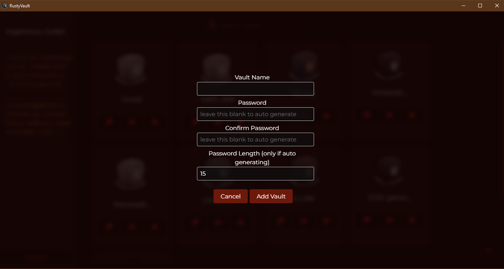
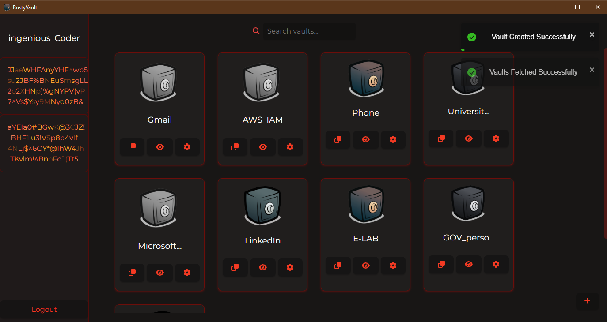
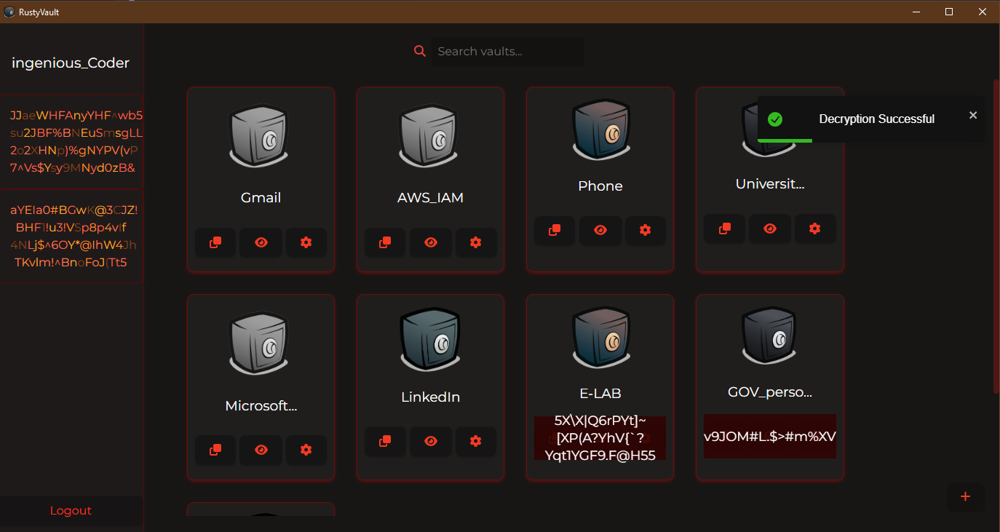
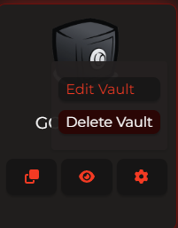
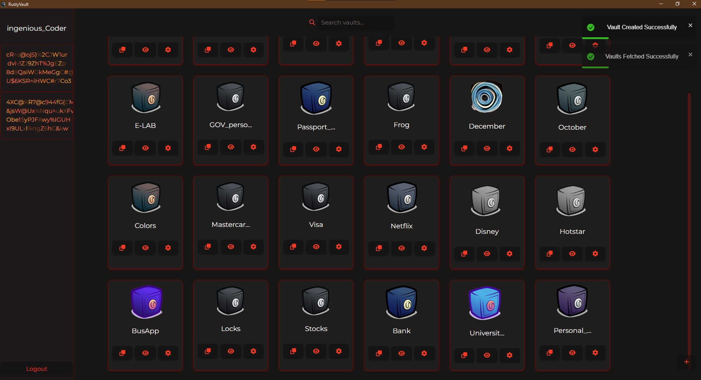

 
    

 
    

# RustyVault

### Your local & secure password manager !

RustyVault is a password manager that stores your passwords locally on your computer. It is written in Rust and uses the Tauri framework to create a cross-platform desktop application. The frontend is written in Next.js and the backend is written in Rust. Strong encryption is provided using local 256 bit key gen and AES-256/RSA encryption.

Rusty Vault is designed to be secure, fast , clean and easy to use.

find more detailed documentation [here](documentation.md)

## First Release (v0.0.1) is out now for Windows ! Get it [here
](https://github.com/Ingenious-c0der/RustyVault/releases/tag/v0.0.1)

Direct download links (Windows only):

1. [RustyVault_x64_setup.exe
   ](https://github.com/Ingenious-c0der/RustyVault/releases/download/v0.0.1/RustyVault_0.0.1_x64-setup.exe)
2. [RustyVault_x64_Microsoft_installer.msi](https://github.com/Ingenious-c0der/RustyVault/releases/download/v0.0.1/RustyVault_0.0.1_x64_en-US.msi)

## 1. Add your passwords easily, never forget a complex random password again!

## 2. Search through thousands of vaults in seconds

### 3. Instant Decryption to either view the password or copy it to your clipboard, password isn't persisted anywhere in its original form!

## 4. Edit or delete vaults without leaving a trace.

## 5. Gotta catch them all (colors) !

# TODOs : (open for contributions on the following)

## 1.Add a vault cluster to view bucket vaults into different categories

    this would require adding a group id to each vault
    by default it would go in the base vault group unless specified
    the vault cluster names wil be visible in the side pane of the application
    and clicking on it you can view the vaults in that cluster

## 2.Give an option to store as many additional key value pairs

    Could be done Serializing the object containing key-value pairs and storing it in the db.
    OR
    Could be done by storing the key-value pairs in a separate table and linking it to the vault id

## 3.Add fingerprint id or sec questions (try to eliminate passwords as much as possible without compromising ease of use)

    modify login form to create a homogeneous key which can be etched instead of solid pass.
    [captcha password? store user pattern instead of password?]

## 4.Extend to mobile devices with bluetooth connectivity

    add bluetooth connectivity to the application to allow for mobile devices to connect to the application
    and transfer/sync user vaults.
    auth with fingerprint id/ OTP

## 5.Auto filling of password fields

    add a feature to auto fill password fields on websites
    [this would require a browser extension]

## 6. Shoot emails to user on login attempts

    add a feature to send an email to the user on login attempts
    [this would require a mail server to be setup]

## 7. Restore vaults if master password is lost.

## 8. Archive deleted vaults, never really delete vaults unless 2FA'ed by user
